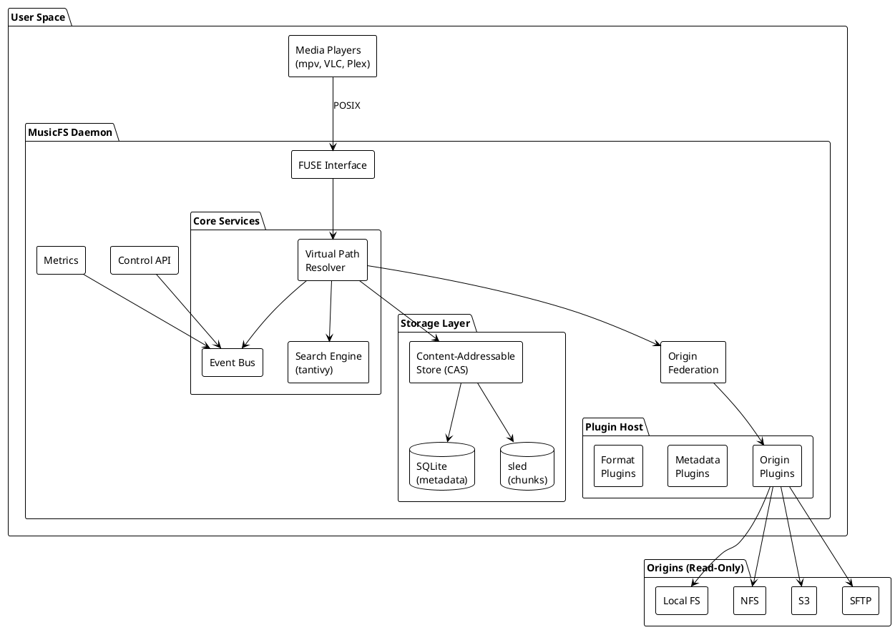
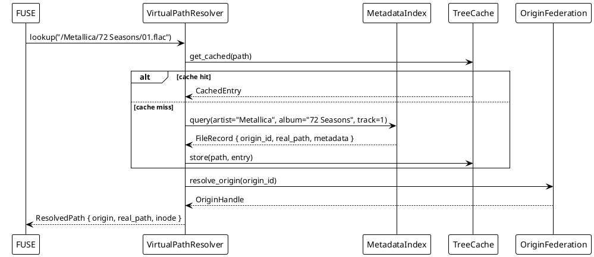
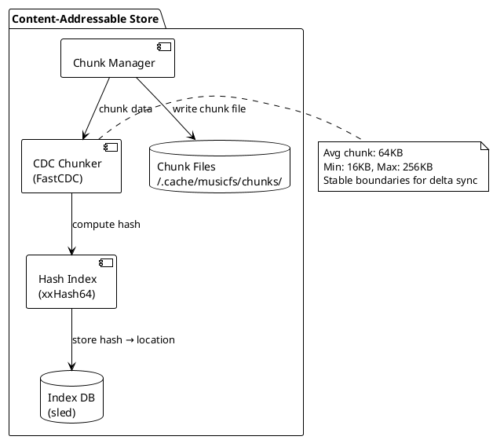
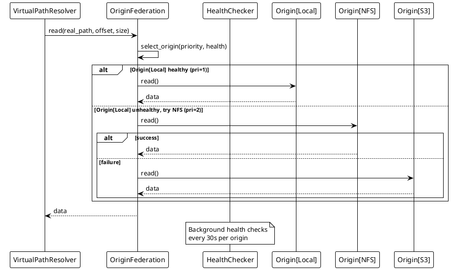
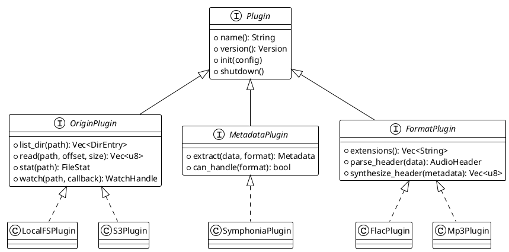
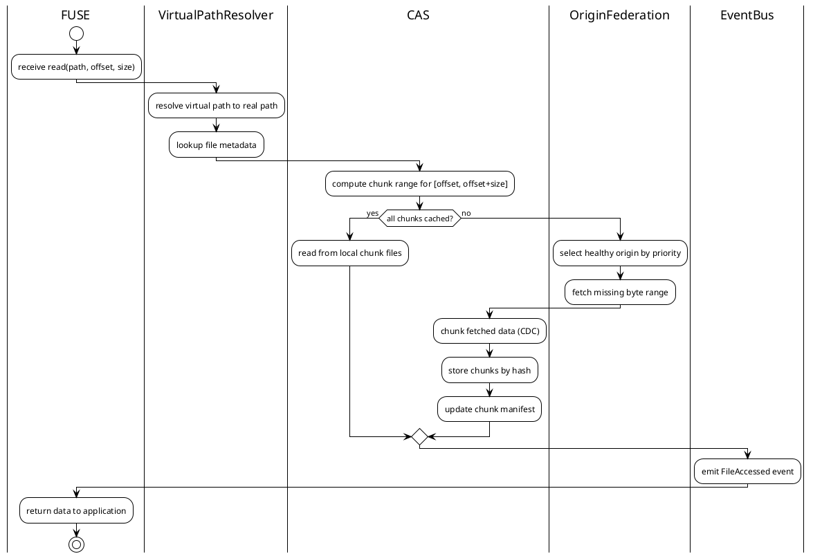
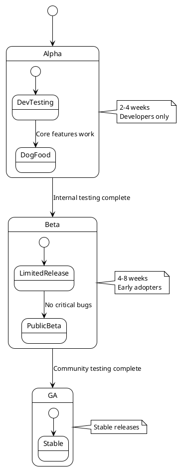

# MusicFS: Design Doc

**Authors:** [TBD]  
**Status:** Draft  
**Last Updated:** 2026-05-12  
**Reviewers:** [TBD]  
**Approvers:** [TBD]  
**Requirements:** [requirements.md](requirements.md)

---

[TOC]

---

## 1. Abstract

MusicFS is a read-only FUSE filesystem that presents music libraries organized
by metadata (artist/album/track) rather than physical file paths. It supports
multiple origin storage backends (local, NFS, S3, SFTP), provides intelligent
caching with delta synchronization, and exposes a plugin architecture for
extensibility.

The system addresses limitations of the existing beetfs implementation:
- O(N) mount time → O(1) lazy loading
- Full file in RAM → streaming with content-addressable chunks  
- Single origin → federated multi-origin with failover
- No offline support → cache-first with graceful degradation

Target users are media enthusiasts with large music collections (100K-10M+
tracks) distributed across multiple storage systems who want a unified,
metadata-organized view without modifying original files.

---

## 2. Background

### 2.1 Current State

The existing beetfs implementation is a Python 2.7 FUSE plugin for beets that:
- Presents a virtual filesystem organized by metadata templates
- Overlays metadata from beets database onto file headers
- Supports metadata writes back to the beets database

### 2.2 Pain Points

| Problem | Impact |
|---------|--------|
| O(N) mount time (5-120s for large libraries) | Unusable for large collections |
| Loads entire file into RAM on open | OOM risk, 50-100MB per file |
| Python GIL limits concurrency | Poor performance under load |
| No caching between sessions | Repeated work on every mount |
| Single local origin only | Can't federate across storage |
| No offline support | Unusable without origin access |
| Critical bugs (nested methods, tree building) | Non-functional |

### 2.3 Related Systems

| System | Relationship |
|--------|--------------|
| [beets](https://beets.io/) | Source of inspiration; potential import source |
| [rclone mount](https://rclone.org/commands/rclone_mount/) | Similar FUSE + remote storage; no metadata organization |
| [Plex/Jellyfin](https://jellyfin.org/) | Media servers with metadata; not filesystem-based |

---

## 3. Goals & Non-Goals

### 3.1 Goals

| ID | Goal | Success Metric |
|----|------|----------------|
| G1 | O(1) mount time | <500ms regardless of library size |
| G2 | Minimal memory footprint | <50MB idle, <500MB peak |
| G3 | Support multiple origins | ≥2 origins with automatic failover |
| G4 | Offline-first operation | Serve cached data when origin unavailable |
| G5 | Delta synchronization | >90% bandwidth reduction vs full sync |
| G6 | Plugin extensibility | Support custom origins, formats, metadata sources |
| G7 | Full-text search | Sub-second search across 1M+ tracks |

### 3.2 Design Requirements

The following quantitative requirements drive architectural decisions. Full
specification in [requirements.md](requirements.md).

#### 3.2.1 Latency Requirements

| Operation | Target | Maximum | Requirement |
|-----------|--------|---------|-------------|
| `stat()` cached | <1ms | 5ms | NFR-1.1 |
| `readdir()` cached | <10ms | 50ms | NFR-1.2 |
| `open()` cached | <5ms | 20ms | NFR-1.3 |
| `read()` cached | <1ms | 5ms | NFR-1.4 |
| `read()` cache miss (local) | <50ms | 200ms | NFR-1.5 |
| `read()` cache miss (remote) | <200ms | 1000ms | NFR-1.6 |
| Mount completion | <100ms | 500ms | NFR-1.7 |
| Search query (1M files) | <500ms | 1000ms | FR-14 |

**Design Response:**
- Lazy loading eliminates mount-time I/O → O(1) mount
- In-memory LRU cache for hot metadata → <1ms stat
- SQLite with indexes → O(log n) lookups
- Async I/O via tokio → non-blocking operations

#### 3.2.2 Throughput Requirements

| Metric | Target | Requirement |
|--------|--------|-------------|
| Sequential read (cached) | >500 MB/s | NFR-2.1 |
| Sequential read (local origin) | >200 MB/s | NFR-2.2 |
| Metadata ops/sec | >1000 | NFR-2.3 |
| Concurrent file handles | >1000 | NFR-2.4 |

**Design Response:**
- Memory-mapped chunk files → kernel-optimized reads
- No GIL (Rust) → true parallelism
- Async FUSE ops → handle many concurrent requests

#### 3.2.3 Scalability Requirements

| Metric | Target | Stretch | Requirement |
|--------|--------|---------|-------------|
| Library size | 1M files | 10M files | NFR-3.1, NFR-3.5 |
| Directory entries | 100K | 1M | NFR-3.2 |
| Concurrent clients | 10 | 100+ | NFR-3.6 |
| Mount time scaling | O(1) | O(1) | NFR-3.3 |

**Design Response:**
- Lazy tree loading → mount time independent of size
- SQLite indexes → O(log n) regardless of scale
- Streaming readdir → handle large directories
- Connection pooling → support many clients

#### 3.2.4 Resource Requirements

| Resource | Idle | Active (1K files) | Peak | Requirement |
|----------|------|-------------------|------|-------------|
| Memory | <50 MB | <200 MB | <500 MB | NFR-4.1-4.3 |
| Per-file overhead | - | <1 KB | - | NFR-4.4 |
| Metadata cache | - | 100 MB default | configurable | NFR-5.1 |
| Content cache | - | 10 GB default | configurable | NFR-5.2 |

**Design Response:**
- Streaming reads → never load full file in memory
- Content-addressed chunks → bounded cache with LRU eviction
- Metadata in SQLite → minimal per-file RAM overhead

#### 3.2.5 Efficiency Requirements

| Metric | Target | Requirement |
|--------|--------|-------------|
| Delta sync bandwidth reduction | >90% | NFR-6.4 |
| Cache hit rate (warm) | >95% | Derived |
| Deduplication ratio | >10% typical | FR-20 |

**Design Response:**
- CDC chunking → stable boundaries, minimal re-transfer
- Content-addressable storage → automatic deduplication
- Prefetch engine → anticipate access patterns

#### 3.2.6 Reliability Requirements

| Scenario | Behavior | Requirement |
|----------|----------|-------------|
| Origin offline | Serve cached data | NFR-7.1 |
| Network failure | Graceful degradation, no crash | NFR-7.2 |
| Failed operation | Retry with backoff (100ms, 500ms, 2s) | NFR-7.3 |
| Malformed audio | Skip file, log error, don't crash | NFR-7.4 |
| Chunk corruption | Detect via checksum, re-fetch | NFR-8.1, NFR-8.4 |
| Interrupted sync | Resume from last good state | NFR-8.3 |
| Unclean unmount | Recover on next mount | NFR-8.2 |

**Design Response:**
- Cache-first architecture → offline operation by default
- Origin federation with health checks → survive single origin failure
- xxHash checksums on all chunks → detect corruption
- WAL mode SQLite → ACID transactions, crash recovery

#### 3.2.7 Concurrent Access Requirements

| Scenario | Limit | Latency Impact | Requirement |
|----------|-------|----------------|-------------|
| Simultaneous open files | >1000 handles | None | NFR-2.4 |
| Parallel read ops | >100 concurrent | <2x p99 latency | Derived |
| Multiple clients | >10 (target 100+) | Linear degradation | NFR-3.6 |
| Readdir during sync | No blocking | Serve stale if needed | FR-9.2 |

**Design Response:**
- Async I/O (tokio) → non-blocking operations
- No GIL → true parallelism across cores
- Read-write locks on cache → readers don't block readers
- Stale-while-revalidate → serve cached during refresh

### 3.3 Non-Goals

| ID | Non-Goal | Rationale |
|----|----------|-----------|
| NG1 | Write to origin files | Read-only by design; preserves originals |
| NG2 | Transcoding | Out of scope for MVP; plugin possible later |
| NG3 | Video file support | Focus on audio; deferred to future |
| NG4 | Distributed/clustered mode | Single-node for MVP; architecture supports later |
| NG5 | Mobile app | CLI/daemon only; filesystem interface |

---

## 4. Proposed Design

### 4.1 High-Level Architecture



### 4.2 Component Overview

| Component | Responsibility | Technology |
|-----------|---------------|------------|
| FUSE Interface | Translate POSIX ops to internal calls | fuser (Rust) |
| Virtual Path Resolver | Map virtual ↔ real paths | Custom |
| Event Bus | Decouple components, enable observability | tokio broadcast |
| Search Engine | Full-text metadata search | tantivy |
| Plugin Host | Load/manage plugins | Native + WASM |
| CAS | Content-addressed chunk storage | Custom + sled |
| Origin Federation | Multi-origin routing with failover | Custom |

### 4.3 Detailed Design

#### 4.3.1 Virtual Path Resolution

The resolver maps metadata-based virtual paths to real origin paths.



**Path Template Grammar:**
```
template     = segment ("/" segment)*
segment      = (literal | variable)+
variable     = "$" identifier
identifier   = "artist" | "album" | "title" | "track" | "year" | "genre" 
             | "format" | "format_upper" | "disc"
```

**Default Template:**
```
$artist/$album ($year) [$format_upper]/$track - $title.$format
```

#### 4.3.2 Content-Addressable Store (CAS)

All file content is stored as content-addressed chunks, enabling deduplication
and efficient delta sync.



**Chunk Storage Layout:**
```
~/.cache/musicfs/
├── chunks/
│   ├── aa/
│   │   ├── aa1b2c3d4e5f6789...  (64KB chunk)
│   │   └── aa9f8e7d6c5b4a32...
│   ├── ab/
│   └── ...  (256 subdirs for distribution)
├── metadata.db     (SQLite: file metadata, tree cache)
├── search.idx/     (tantivy: full-text index)
└── chunks.sled/    (sled: hash → chunk location)
```

#### 4.3.3 Origin Federation

Multiple origins are managed with priority-based routing and health tracking.



**Origin Configuration:**
```toml
[[origins]]
id = "local"
type = "local"
path = "/mnt/nas/music"
priority = 1

[[origins]]
id = "backup"
type = "s3"
bucket = "music-backup"
priority = 2
```

#### 4.3.4 Plugin System

Plugins extend functionality without modifying core code.



**Plugin Loading:**
1. **Built-in:** Compiled into binary (Local, S3, SFTP, symphonia)
2. **Native:** Dynamic libraries (`.so`/`.dylib`) loaded at runtime
3. **WASM:** Sandboxed plugins via wasmtime (future)

#### 4.3.5 Data Flow: Read Operation



#### 4.3.6 Data Schema

**Metadata Index (SQLite):**
```sql
CREATE TABLE files (
    id              INTEGER PRIMARY KEY,
    origin_id       TEXT NOT NULL,
    real_path       TEXT NOT NULL,
    virtual_path    TEXT NOT NULL,
    
    -- Metadata (see FR-6 in requirements.md)
    title           TEXT,
    artist          TEXT,
    album           TEXT,
    album_artist    TEXT,
    genre           TEXT,
    year            INTEGER,
    track           INTEGER,
    disc            INTEGER,
    duration_ms     INTEGER,
    bitrate         INTEGER,
    sample_rate     INTEGER,
    format          TEXT,
    
    -- Sync state
    origin_mtime    INTEGER,
    origin_size     INTEGER,
    content_hash    TEXT,
    chunk_manifest  BLOB,       -- msgpack: [(chunk_hash, offset, size)]
    last_sync       INTEGER,
    
    UNIQUE(origin_id, real_path)
);

CREATE INDEX idx_virtual ON files(virtual_path);
CREATE INDEX idx_artist_album ON files(artist, album);
CREATE INDEX idx_content_hash ON files(content_hash);

CREATE TABLE artwork (
    id          INTEGER PRIMARY KEY,
    file_id     INTEGER REFERENCES files(id),
    art_type    TEXT,           -- 'front', 'back'
    chunk_hash  TEXT,           -- reference to CAS
    width       INTEGER,
    height      INTEGER,
    UNIQUE(file_id, art_type)
);

CREATE TABLE collections (
    id          INTEGER PRIMARY KEY,
    name        TEXT UNIQUE,
    query_json  TEXT,           -- smart collection query
    created_at  INTEGER
);
```

#### 4.3.7 Control API

**Protocol Choice: gRPC over Unix Socket**

| Criterion | JSON-RPC | gRPC | Winner |
|-----------|----------|------|--------|
| Type safety | Runtime validation | Compile-time (protobuf) | gRPC |
| Schema evolution | Ad-hoc versioning | Built-in field numbering | gRPC |
| Streaming | Requires WebSocket/polling | Native bidirectional | gRPC |
| Client generation | Manual per language | Auto-gen 10+ languages | gRPC |
| Performance | JSON parse overhead | Binary, zero-copy | gRPC |
| Debugging | Human-readable | Needs tooling (grpcurl) | JSON-RPC |
| Simplicity | Lower barrier | Requires protoc | JSON-RPC |

**Decision:** gRPC for primary API. Human-readable debugging via `grpcurl` and CLI wrapper.

**Rationale:**
1. **Event streaming** - Native server-streaming for real-time sync/cache events without polling
2. **Multi-language clients** - Auto-generated clients for Python (beets integration), Go, Node.js
3. **Schema evolution** - Protobuf field numbering allows backward-compatible API changes
4. **Performance** - Binary encoding avoids JSON serialization overhead on high-frequency stat() calls

---

**Protocol Buffer Definitions:**

```protobuf
syntax = "proto3";
package musicfs.v1;

// ============================================================================
// Core Services
// ============================================================================

service MusicFS {
    // Daemon lifecycle
    rpc GetStatus(Empty) returns (StatusResponse);
    rpc Shutdown(ShutdownRequest) returns (Empty);
    
    // Cache management
    rpc GetCacheStats(Empty) returns (CacheStats);
    rpc ClearCache(ClearCacheRequest) returns (ClearCacheResponse);
    rpc Prefetch(PrefetchRequest) returns (stream PrefetchProgress);
    
    // Origin management
    rpc ListOrigins(Empty) returns (OriginsResponse);
    rpc GetOriginHealth(OriginRequest) returns (OriginHealth);
    rpc RescanOrigin(OriginRequest) returns (stream SyncProgress);
    
    // Search
    rpc Search(SearchRequest) returns (SearchResponse);
    rpc SearchStream(SearchRequest) returns (stream SearchResult);
    
    // Events (server-streaming)
    rpc SubscribeEvents(EventFilter) returns (stream Event);
}

// ============================================================================
// Messages: Daemon
// ============================================================================

message Empty {}

message StatusResponse {
    string version = 1;
    uint64 uptime_seconds = 2;
    string mount_point = 3;
    MountState state = 4;
    uint32 open_file_handles = 5;
    uint64 fuse_ops_total = 6;
}

enum MountState {
    MOUNT_STATE_UNKNOWN = 0;
    MOUNT_STATE_MOUNTING = 1;
    MOUNT_STATE_READY = 2;
    MOUNT_STATE_SYNCING = 3;
    MOUNT_STATE_DEGRADED = 4;  // Some origins unavailable
    MOUNT_STATE_UNMOUNTING = 5;
}

message ShutdownRequest {
    bool force = 1;              // Skip graceful drain
    uint32 drain_timeout_ms = 2; // Max wait for in-flight ops (default: 5000)
}

// ============================================================================
// Messages: Cache
// ============================================================================

message CacheStats {
    // Hit/miss counters
    uint64 hits = 1;
    uint64 misses = 2;
    double hit_rate = 3;
    
    // Storage
    uint64 chunks_stored = 4;
    uint64 chunks_unique = 5;    // After deduplication
    double dedup_ratio = 6;      // Space saved by dedup
    uint64 size_bytes = 7;
    uint64 size_limit_bytes = 8;
    
    // Metadata cache
    uint64 metadata_entries = 9;
    uint64 metadata_bytes = 10;
    
    // Per-tier breakdown
    TierStats l1_metadata = 11;
    TierStats l2_headers = 12;
    TierStats l3_chunks = 13;
}

message TierStats {
    uint64 entries = 1;
    uint64 bytes = 2;
    uint64 evictions = 3;
}

message ClearCacheRequest {
    optional string origin_id = 1;  // Empty = all origins
    CacheTier tier = 2;             // Which tier to clear
    bool dry_run = 3;               // Report what would be cleared
}

enum CacheTier {
    CACHE_TIER_ALL = 0;
    CACHE_TIER_METADATA = 1;
    CACHE_TIER_HEADERS = 2;
    CACHE_TIER_CHUNKS = 3;
}

message ClearCacheResponse {
    uint64 entries_cleared = 1;
    uint64 bytes_freed = 2;
}

message PrefetchRequest {
    repeated string paths = 1;      // Virtual paths to prefetch
    optional string query = 2;      // Or search query
    PrefetchStrategy strategy = 3;
}

enum PrefetchStrategy {
    PREFETCH_METADATA_ONLY = 0;     // Just stat info
    PREFETCH_HEADERS = 1;           // Metadata + audio headers
    PREFETCH_FULL = 2;              // Complete file content
}

message PrefetchProgress {
    string path = 1;
    uint64 bytes_fetched = 2;
    uint64 bytes_total = 3;
    bool complete = 4;
    optional string error = 5;
}

// ============================================================================
// Messages: Origins
// ============================================================================

message OriginRequest {
    string origin_id = 1;
}

message OriginsResponse {
    repeated OriginInfo origins = 1;
}

message OriginInfo {
    string id = 1;
    string origin_type = 2;         // "local", "sftp", "s3", "smb"
    string display_name = 3;
    OriginHealth health = 4;
    uint64 file_count = 5;
    uint64 total_bytes = 6;
    int64 last_sync_unix = 7;
}

message OriginHealth {
    HealthStatus status = 1;
    uint32 latency_ms = 2;
    optional string error_message = 3;
    int64 last_check_unix = 4;
}

enum HealthStatus {
    HEALTH_UNKNOWN = 0;
    HEALTH_HEALTHY = 1;
    HEALTH_DEGRADED = 2;            // Slow but working
    HEALTH_UNHEALTHY = 3;           // Connection failed
}

message SyncProgress {
    string origin_id = 1;
    SyncPhase phase = 2;
    uint64 files_scanned = 3;
    uint64 files_changed = 4;
    uint64 files_total = 5;
    uint64 bytes_transferred = 6;
    optional string current_file = 7;
    bool complete = 8;
    optional string error = 9;
}

enum SyncPhase {
    SYNC_PHASE_SCANNING = 0;
    SYNC_PHASE_COMPARING = 1;
    SYNC_PHASE_FETCHING = 2;
    SYNC_PHASE_INDEXING = 3;
    SYNC_PHASE_COMPLETE = 4;
}

// ============================================================================
// Messages: Search
// ============================================================================

message SearchRequest {
    string query = 1;               // Full-text query
    uint32 limit = 2;               // Max results (default: 100)
    uint32 offset = 3;              // Pagination
    repeated string fields = 4;     // Restrict to fields: artist, album, title
    optional string origin_id = 5;  // Filter by origin
}

message SearchResponse {
    repeated SearchResult results = 1;
    uint64 total_matches = 2;
    uint32 query_time_ms = 3;
}

message SearchResult {
    string virtual_path = 1;
    string title = 2;
    string artist = 3;
    string album = 4;
    float score = 5;                // Relevance score
    map<string, string> highlights = 6;  // Field -> highlighted snippet
}

// ============================================================================
// Messages: Events
// ============================================================================

message EventFilter {
    repeated EventType types = 1;   // Empty = all events
    optional string origin_id = 2;  // Filter by origin
}

enum EventType {
    EVENT_TYPE_ALL = 0;
    EVENT_TYPE_FILE_ADDED = 1;
    EVENT_TYPE_FILE_REMOVED = 2;
    EVENT_TYPE_FILE_MODIFIED = 3;
    EVENT_TYPE_ORIGIN_CONNECTED = 4;
    EVENT_TYPE_ORIGIN_DISCONNECTED = 5;
    EVENT_TYPE_SYNC_STARTED = 6;
    EVENT_TYPE_SYNC_COMPLETED = 7;
    EVENT_TYPE_CACHE_EVICTION = 8;
}

message Event {
    EventType type = 1;
    int64 timestamp_unix = 2;
    string origin_id = 3;
    optional string path = 4;
    map<string, string> metadata = 5;
}
```

---

**CLI Interface** (wraps gRPC client):

```bash
musicfs mount /mnt/music           # Mount filesystem
musicfs status                      # GetStatus()
musicfs cache stats                 # GetCacheStats()
musicfs cache clear --origin=local  # ClearCache(origin_id="local")
musicfs search "metallica heavy"    # Search(query="metallica heavy")
musicfs origin list                 # ListOrigins()
musicfs origin rescan local         # RescanOrigin() with progress
musicfs events --type=file_added    # SubscribeEvents() stream
```

**Debugging:**
```bash
# Direct gRPC inspection via grpcurl
grpcurl -unix /run/musicfs.sock musicfs.v1.MusicFS/GetStatus
grpcurl -unix /run/musicfs.sock -d '{"query":"metallica"}' musicfs.v1.MusicFS/Search
```

---

## 5. Cross-Cutting Concerns

### 5.1 Security & Privacy

| Concern | Mitigation |
|---------|------------|
| Credential storage | Use system keyring (secret-service) or env vars; never in config file |
| Credential exposure | Redact from logs; exclude from `/proc/cmdline` |
| Cache at rest | Optional encryption via age/libsodium (P3 requirement) |
| Plugin sandboxing | WASM plugins run in wasmtime sandbox; native plugins require trust |
| Access control | Respect origin permissions; run as unprivileged user |
| No PII handling | Filesystem metadata only; no user data collected |

### 5.2 Observability

**Metrics (Prometheus format):**
```
musicfs_fuse_ops_total{op="read"} 152341
musicfs_fuse_ops_total{op="readdir"} 8234
musicfs_fuse_latency_seconds{op="read",quantile="0.99"} 0.004
musicfs_cache_hits_total 142107
musicfs_cache_misses_total 10234
musicfs_cache_size_bytes 5368709120
musicfs_origin_health{origin="local"} 1
musicfs_origin_health{origin="s3"} 0
musicfs_sync_files_changed{origin="local"} 15
```

**Logging Levels:**
| Level | Content |
|-------|---------|
| ERROR | Unrecoverable failures, data corruption |
| WARN | Recoverable failures, origin timeouts |
| INFO | Mount/unmount, sync completion, config reload |
| DEBUG | Cache hits/misses, origin selection |
| TRACE | Individual FUSE operations, chunk I/O |

**Golden Signals Dashboard:**
1. **Latency:** p50/p95/p99 for read, stat, readdir
2. **Traffic:** FUSE ops/sec, bytes read/sec
3. **Errors:** Origin failures, cache corruption
4. **Saturation:** Cache fullness, open file handles

### 5.3 Scalability & Performance

**Expected Load:**
| Metric | Target | Maximum |
|--------|--------|---------|
| Library size | 1M files | 10M files |
| Concurrent clients | 10 | 100+ |
| FUSE ops/sec | 1,000 | 10,000 |
| Read throughput | 500 MB/s | 1 GB/s |

**Scaling Strategy:**
- **Horizontal:** Not supported (single daemon per mountpoint)
- **Vertical:** Increase cache size, add origins

**Resource Requirements:**
| Resource | Minimum | Recommended |
|----------|---------|-------------|
| CPU | 1 core | 4 cores |
| RAM | 256 MB | 2 GB |
| Disk (cache) | 1 GB | 50 GB |
| Network | 10 Mbps | 1 Gbps |

### 5.4 Testing Plan

| Test Type | Scope | Tools |
|-----------|-------|-------|
| Unit | Individual components | cargo test |
| Integration | Component interaction | cargo test --features integration |
| E2E | Full FUSE operations | pytest + real mount |
| Performance | Latency, throughput | criterion.rs, custom benchmarks |
| Stress | High load, large libraries | locust, custom generators |
| Chaos | Origin failures, network issues | toxiproxy |

**Test Matrix:**
```
Origins:     [local, s3, sftp] × [healthy, degraded, offline]
Cache:       [cold, warm, full]
Library:     [100, 10K, 1M, 10M] files
Operations:  [mount, readdir, stat, read, search]
```

---

## 6. Alternatives Considered

### 6.1 Alternative A: Extend beetfs (Python)

**Description:** Fix bugs in existing beetfs, add features incrementally.

**Rejected Because:**
- Python GIL fundamentally limits concurrency
- Python 2.7 EOL; migration to Python 3 substantial
- Architecture (full file in RAM) requires rewrite anyway
- No async I/O support in fuse-python

### 6.2 Alternative B: Use rclone mount

**Description:** Use rclone's FUSE mount with VFS caching.

**Rejected Because:**
- No metadata-based virtual path organization
- No metadata overlay functionality
- Limited plugin extensibility
- Would require forking and heavy modification

### 6.3 Alternative C: Build as Plex/Jellyfin Plugin

**Description:** Extend existing media server with virtual filesystem view.

**Rejected Because:**
- Tied to specific media server
- Not a true filesystem (no POSIX interface)
- Heavy runtime dependency
- Different use case (streaming vs filesystem)

### 6.4 Alternative D: Go Implementation

**Description:** Implement in Go using go-fuse.

**Considered Trade-offs:**
| Aspect | Rust | Go |
|--------|------|-----|
| Memory safety | Compile-time | GC pauses |
| Concurrency | async/await, no GC | goroutines, GC |
| FUSE library | fuser (mature) | go-fuse (mature) |
| Learning curve | Steeper | Gentler |
| Binary size | Smaller | Larger |

**Decision:** Rust chosen for zero-cost abstractions, no GC pauses during I/O,
and better fit for systems programming.

---

## 7. Implementation Plan

### 7.1 Phase 1: MVP (4.5 weeks)

**Goal:** Basic functional filesystem with single origin.

| Week | Deliverables |
|------|--------------|
| 1 | Project setup, FUSE skeleton, local origin plugin |
| 2 | Metadata extraction (symphonia), SQLite schema |
| 3 | Virtual path resolver, tree cache, basic readdir/stat/read |
| 4 | CAS implementation, chunk caching, LRU eviction |
| 4b | Origin→CAS connector (ContentFetcher), cache-miss handling |

**Exit Criteria:**
- Mount and browse local music library
- Play audio files through mounted filesystem
- Cache persists across restarts

### 7.2 Phase 2: Delta Sync & Multi-Origin (3 weeks)

**Goal:** Efficient synchronization and origin federation.

| Week | Deliverables |
|------|--------------|
| 5 | CDC chunking (FastCDC), delta detection |
| 6 | Origin federation, priority routing, health checks |
| 7 | S3 origin plugin, SFTP origin plugin |

**Exit Criteria:**
- Delta sync achieves >90% bandwidth reduction
- Automatic failover between origins
- Remote origins functional

### 7.3 Phase 3: Search & Smart Features (2 weeks)

**Goal:** Full-text search and intelligent caching.

| Week | Deliverables |
|------|--------------|
| 8 | tantivy integration, search indexing, `/.search/` virtual dir |
| 9 | Smart collections, prefetch engine, access pattern learning |

**Exit Criteria:**
- Search returns results in <1s for 1M tracks
- Prefetch reduces cache misses by >50%

### 7.4 Phase 4: Plugin System & Polish (2 weeks)

**Goal:** Extensibility and production readiness.

| Week | Deliverables |
|------|--------------|
| 10 | Plugin host, plugin API stabilization, example plugins |
| 11 | Control API, metrics, documentation, packaging |

**Exit Criteria:**
- Custom origin plugin loadable at runtime
- Prometheus metrics exported
- systemd service functional

### 7.5 Rollout Strategy



**Feature Flags:**
```toml
[features]
search_enabled = true
smart_collections = false  # Beta
wasm_plugins = false       # Experimental
```

**Rollback:** Binary replacement + cache clear; no data migration needed.

---

## 8. Glossary & References

### 8.1 Glossary

| Term | Definition |
|------|------------|
| **CAS** | Content-Addressable Store; data stored/retrieved by hash |
| **CDC** | Content-Defined Chunking; chunking with stable boundaries |
| **FUSE** | Filesystem in Userspace; kernel interface for user-space filesystems |
| **Origin** | Source storage backend (local, S3, NFS, etc.) |
| **Virtual Path** | Metadata-derived path shown to users |
| **Real Path** | Actual path on origin storage |

### 8.2 References

| Document | Link |
|----------|------|
| Requirements Specification | [requirements.md](requirements.md) |
| beetfs (Original) | [beetsplug/beetFs.py](../../beetsplug/beetFs.py) |
| beetfs Features | [v1/features.md](../v1/features.md) |
| fuser (Rust FUSE) | https://github.com/cberner/fuser |
| tantivy (Search) | https://github.com/quickwit-oss/tantivy |
| symphonia (Audio) | https://github.com/pdrat/symphonia |
| FastCDC | https://github.com/nlfiedler/fastcdc-rs |
| wasmtime | https://wasmtime.dev/ |

### 8.3 Dependencies

| Crate | Version | Purpose |
|-------|---------|---------|
| fuser | 0.14+ | FUSE interface |
| tokio | 1.x | Async runtime |
| rusqlite | 0.31+ | SQLite bindings |
| sled | 0.34+ | Embedded key-value store |
| tantivy | 0.21+ | Full-text search |
| symphonia | 0.5+ | Audio metadata extraction |
| fastcdc | 3.x | Content-defined chunking |
| xxhash-rust | 0.8+ | Fast hashing |
| serde | 1.x | Serialization |
| toml | 0.8+ | Configuration |
| tracing | 0.1+ | Logging/instrumentation |
| metrics | 0.22+ | Prometheus metrics |
