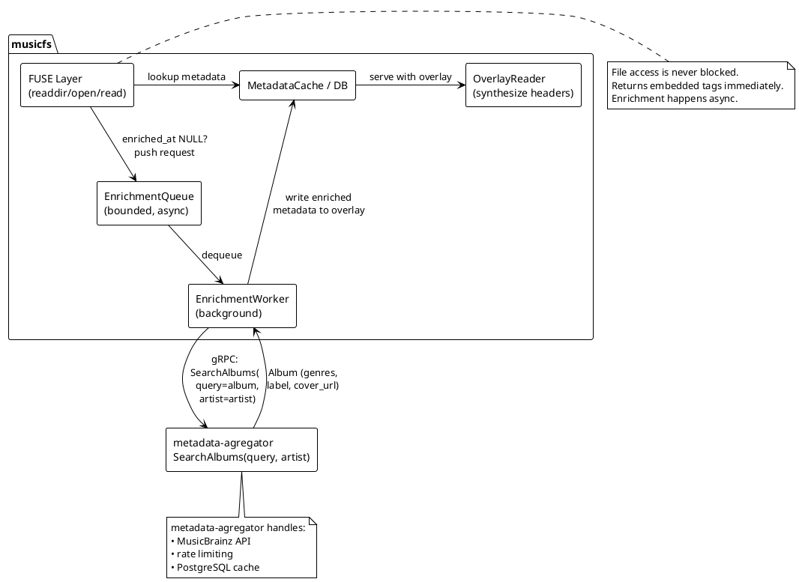
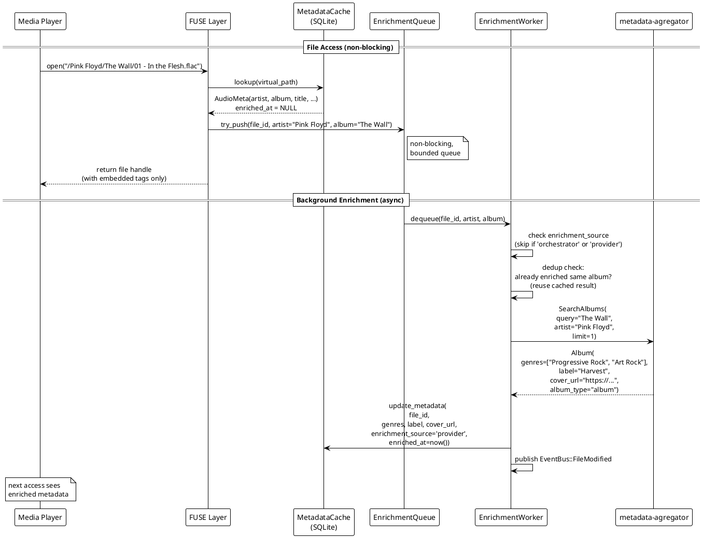

# Metadata Enrichment (Standalone Mode): Design Doc

**Authors:** Sisyphus  
**Status:** Draft  
**Last Updated:** 2026-05-18  
**Reviewers:** —  
**Approvers:** —  
**Document Link:** `docs/v2/plans/metadata-enrichment-standalone.md`  
**Prerequisites:** [architecture.md](../architecture.md), [week-12-external-metadata.md](week-12-external-metadata.md)

---

## 1. Abstract

When musicfs operates without the music-agregator orchestrator, it should
still be able to enrich file metadata (genres, label, artwork URL, album
type) by querying the metadata-agregator service directly. This document
describes a **built-in metadata provider** compiled into musicfs that
queries metadata-agregator's gRPC `SearchAlbums` endpoint using
artist + album names extracted from file tags. Enrichment is lazy and
non-blocking — file access always returns immediately using embedded
tags, while a background worker enriches metadata asynchronously.

This plan **supersedes** the week-12 plan's approach of embedding
MusicBrainz/Discogs/Last.fm HTTP clients directly into musicfs. Instead,
musicfs delegates all external metadata resolution to metadata-agregator,
which already handles provider APIs, rate limiting, and caching.

## 2. Background

### 2.1. Current State

musicfs extracts audio metadata via symphonia (FLAC, MP3, AAC, OGG,
Opus) and stores it in `AudioMeta`. This metadata is whatever the file
tags contain — typically title, artist, album, year, track number.

The existing plugin system (`musicfs-plugins`) defines a `MetadataPlugin`
trait for external metadata lookup, but:

- No plugins have been implemented yet.
- The plugin system only supports native `.so` and WASM plugins.
- A gRPC client to metadata-agregator would require bundling an async
  runtime and tonic inside a `.so` — an awkward fit.

Meanwhile, metadata-agregator is a Go gRPC service that:

- Searches MusicBrainz by artist + album name (`SearchAlbums` RPC).
- Caches results in PostgreSQL.
- Returns rich metadata: genres, cover URL, label, release date, album
  type, artist credits.

### 2.2. Pain Points

- musicfs files lack genres, artwork URLs, and label info unless the
  original files were meticulously tagged.
- The week-12 plan proposed embedding 4 separate HTTP API clients
  (MusicBrainz, Discogs, Last.fm, AcoustID) directly into musicfs,
  duplicating what metadata-agregator already does.
- The `MetadataPlugin` trait is designed for `.so`/WASM plugins, which
  is wrong for a core infrastructure gRPC client.

## 3. Goals & Non-Goals

### 3.1. Goals

- **G1:** Enrich file metadata with genres, label, album type, and cover
  URL by querying metadata-agregator via gRPC.
- **G2:** Never block file access — enrichment happens in background.
- **G3:** Make the provider entirely optional — disabled by default,
  musicfs works identically without it.
- **G4:** Respect enrichment source priority so orchestrator pushes
  (from the full-system mode) are not overwritten.

### 3.2. Non-Goals

- **NG1:** Embedding MusicBrainz/Discogs/Last.fm HTTP clients directly
  into musicfs (metadata-agregator handles this).
- **NG2:** Audio fingerprinting (AcoustID) — deferred to future work.
- **NG3:** Modifying the existing `MetadataPlugin` trait — the built-in
  provider is separate from the plugin system.
- **NG4:** Bidirectional communication — musicfs only queries
  metadata-agregator, never the reverse.

## 4. Proposed Design

### 4.1. High-Level Architecture



### 4.2. Enrichment Flow



### 4.3. Detailed Design

#### 4.3.1. Configuration

Add `[metadata_provider]` section to `config.toml`:

```toml
[metadata_provider]
enabled = false                       # disabled by default
endpoint = "http://localhost:50051"    # metadata-agregator gRPC
timeout_ms = 5000                     # per-request timeout
retry_max = 3                         # max retries on failure
retry_backoff_ms = 1000               # initial backoff between retries
queue_size = 256                      # enrichment queue capacity
```

Config struct addition in `musicfs-core/src/config.rs`:

```rust
#[derive(Debug, Clone, Serialize, Deserialize, Default)]
pub struct MetadataProviderConfig {
    #[serde(default)]
    pub enabled: bool,
    #[serde(default = "default_provider_endpoint")]
    pub endpoint: String,
    #[serde(default = "default_provider_timeout_ms")]
    pub timeout_ms: u64,
    #[serde(default = "default_retry_max")]
    pub retry_max: u32,
    #[serde(default = "default_retry_backoff_ms")]
    pub retry_backoff_ms: u64,
    #[serde(default = "default_queue_size")]
    pub queue_size: usize,
}
```

#### 4.3.2. Built-in Metadata Provider

New module in `musicfs-metadata` (not a plugin, compiled in):

```rust
// musicfs-metadata/src/provider.rs

pub struct MetadataAgregatorProvider {
    client: MetadataServiceClient<Channel>,
    config: MetadataProviderConfig,
}

impl MetadataAgregatorProvider {
    pub async fn connect(config: &MetadataProviderConfig)
        -> Result<Self>;

    /// Query metadata-agregator by artist + album names.
    /// Returns enriched metadata if a match is found.
    pub async fn lookup(
        &self,
        artist: &str,
        album: &str,
    ) -> Result<Option<EnrichedMetadata>>;
}
```

The `lookup` method calls `SearchAlbums(query=album, artist=artist,
limit=1)` on metadata-agregator. If a result is returned, it maps
the response to `EnrichedMetadata`:

```rust
pub struct EnrichedMetadata {
    pub genres: Vec<String>,
    pub label: Option<String>,
    pub album_type: Option<String>,
    pub cover_url: Option<String>,
    pub release_date: Option<String>,
    pub total_tracks: Option<u32>,
    pub total_discs: Option<u32>,
}
```

#### 4.3.3. ExternalMetadata Extension

Extend the existing `ExternalMetadata` in `musicfs-plugins/src/traits.rs`
to carry richer data:

```rust
pub struct ExternalMetadata {
    // existing fields...
    pub title: Option<String>,
    pub artist: Option<String>,
    pub album: Option<String>,
    pub album_artist: Option<String>,
    pub genre: Option<String>,      // kept for backward compat
    pub year: Option<u32>,
    pub track: Option<u32>,
    pub disc: Option<u32>,
    pub musicbrainz_id: Option<String>,
    pub artwork_url: Option<String>,

    // new fields
    pub genres: Vec<String>,
    pub label: Option<String>,
    pub album_type: Option<String>,
    pub cover_url: Option<String>,
}
```

#### 4.3.4. Database Schema Changes

Add columns to `file_metadata` table in
`musicfs-cache/src/schema.sql`:

```sql
ALTER TABLE file_metadata ADD COLUMN enrichment_source TEXT;
    -- 'embedded' | 'provider' | 'orchestrator'
ALTER TABLE file_metadata ADD COLUMN enriched_at INTEGER;
    -- unix timestamp, NULL = not enriched
ALTER TABLE file_metadata ADD COLUMN enrichment_attempts INTEGER DEFAULT 0;
    -- number of failed enrichment attempts
ALTER TABLE file_metadata ADD COLUMN last_enrichment_error TEXT;
    -- last error message, NULL if no error
ALTER TABLE file_metadata ADD COLUMN genres_json TEXT;
    -- JSON array: '["Progressive Rock","Art Rock"]'
    -- separate from existing `genre` (singular) for backward compat
ALTER TABLE file_metadata ADD COLUMN label TEXT;
ALTER TABLE file_metadata ADD COLUMN album_type TEXT;
ALTER TABLE file_metadata ADD COLUMN cover_url TEXT;
```

> **Note:** The existing `genre TEXT` column (singular) is preserved
> for backward compatibility. `genres_json` stores the full list.
> The singular `genre` field is set to the first genre in the array
> when enriched.

#### 4.3.5. Background Enrichment Queue + Worker

```rust
// musicfs-metadata/src/enrichment.rs

pub struct EnrichmentQueue {
    tx: mpsc::Sender<EnrichmentRequest>,
    /// Tracks in-flight (artist, album) pairs to prevent duplicate
    /// API calls when multiple tracks from the same album are
    /// accessed simultaneously.
    in_flight: Arc<DashSet<(String, String)>>,
}

struct EnrichmentRequest {
    file_id: FileId,
    artist: String,
    album: String,
}

pub struct EnrichmentWorker {
    rx: mpsc::Receiver<EnrichmentRequest>,
    provider: Arc<MetadataAgregatorProvider>,
    db: Arc<Database>,
    event_bus: Arc<EventBus>,
    in_flight: Arc<DashSet<(String, String)>>,
    config: MetadataProviderConfig,
}
```

##### Enqueue-time dedup

When `EnrichmentQueue::try_push()` is called, it checks the
`in_flight` `DashSet` before pushing. If `(artist, album)` is
already in the set, the request is dropped (the worker will enrich
all files with the same album in one pass). This prevents 12
simultaneous track opens from making 12 identical API calls.

If `try_push` fails because the queue is full, log at WARN level
and increment `enrichment_queue_drops_total` metric.

##### Worker loop (single-threaded, processes one at a time):

1. Dequeue `EnrichmentRequest`.
2. Check `enrichment_attempts` — skip if `>= retry_max`.
3. **Atomic conflict check**: write uses conditional SQL:
   ```sql
   UPDATE file_metadata SET
     genres_json = ?, label = ?, album_type = ?, cover_url = ?,
     genre = ?,  -- first genre for backward compat
     enrichment_source = 'provider',
     enriched_at = strftime('%s', 'now'),
     enrichment_attempts = 0,
     last_enrichment_error = NULL
   WHERE file_id = ?
     AND (enrichment_source IS NULL OR enrichment_source = 'embedded')
   ```
   This prevents the TOCTOU race — if the orchestrator wrote between
   dequeue and now, the `WHERE` clause prevents overwrite. The UPDATE
   returns rows_affected=0, which the worker treats as "skip, already
   enriched by higher-priority source".
4. Deduplicate by (artist, album) — if another file in the same album
   was already enriched, reuse the cached `EnrichedMetadata` result
   for all files with the same (artist, album) pair.
5. Call `provider.lookup(artist, album)`.
6. On success: execute atomic update (step 3) for all files with this
   (artist, album). Publish `EventBus::FileModified` for each updated
   file. Remove `(artist, album)` from `in_flight` set.
7. On failure: increment `enrichment_attempts`, set
   `last_enrichment_error`. If `attempts < retry_max`, re-enqueue
   with exponential backoff (`retry_backoff_ms * 2^attempts`).
   If `attempts >= retry_max`, log at WARN and stop retrying.
   Remove from `in_flight` set.

##### Shutdown behavior

Queue contents are lost on shutdown. This is acceptable — files will
be re-queued on next access since `enriched_at` is still NULL.
Enrichment is idempotent.

#### 4.3.6. FUSE Integration Point

In the FUSE `readdir` / `getattr` / `open` path
(`musicfs-fuse/src/ops.rs`), after loading `AudioMeta` from DB:

```rust
if metadata_provider.is_enabled()
    && file_meta.enriched_at.is_none()
    && file_meta.enrichment_attempts < config.retry_max
    && file_meta.audio.artist.is_some()
    && file_meta.audio.album.is_some()
{
    if let Err(_) = enrichment_queue.try_push(EnrichmentRequest {
        file_id: file_meta.id,
        artist: file_meta.audio.artist.unwrap(),
        album: file_meta.audio.album.unwrap(),
    }) {
        // Queue full — file will be retried on next access
        tracing::warn!(
            file_id = ?file_meta.id,
            "enrichment queue full, dropping request"
        );
        metrics::ENRICHMENT_QUEUE_DROPS.inc();
    }
    // Non-blocking: returns immediately with embedded tags
}
```

The `enrichment_attempts < retry_max` check prevents files that have
permanently failed enrichment (e.g., metadata-agregator has no match)
from being re-queued on every access.

#### 4.3.7. Conflict Resolution

| Source | Priority | Writes When |
|--------|----------|-------------|
| `orchestrator` | Highest | Always overwrites (full-system mode push) |
| `provider` | Medium | Only if current source is NULL or `'embedded'` |
| `embedded` | Lowest | Implicit default from file tag parsing |

Conflict resolution is enforced **atomically at write time** using
conditional SQL (`WHERE enrichment_source IS NULL OR
enrichment_source = 'embedded'`), not at dequeue time. This prevents
the TOCTOU race where the orchestrator writes between the worker's
check and the worker's write.

#### 4.3.8. Proto Changes Required

The existing `UpdateMetadataRequest` in `musicfs.proto` must be
extended to carry the new enrichment fields:

```protobuf
// Add to UpdateMetadataRequest:
optional string label = 40;
optional string album_type = 41;
optional string cover_url = 42;
```

> **Note on genres:** metadata-agregator returns `repeated Genre`
> (objects with `id` + `name`). The provider extracts genre names
> and stores them as a JSON array in `genres_json`. The singular
> `genre` field in `UpdateMetadataRequest` (already exists at
> field 9) is set to the first/primary genre for backward compat.

#### 4.3.9. `cover_url` Usage

`cover_url` is stored in the metadata overlay but is **not used by
musicfs for artwork embedding or display** in this plan. It is
stored for consumption by external tools (e.g., media players that
query musicfs's gRPC `GetMetadata` and fetch artwork themselves).
Artwork download and caching is deferred to future work.

## 5. Cross-Cutting Concerns

### 5.1. Security & Privacy

- gRPC connection to metadata-agregator is plaintext (internal network).
  TLS can be added via config if needed.
- No PII involved — only music metadata.
- No API keys stored in musicfs — metadata-agregator handles provider
  auth.

### 5.2. Observability

New tracing spans and metrics:

| Metric | Type | Description |
|--------|------|-------------|
| `enrichment_queue_depth` | Gauge | Current queue size |
| `enrichment_queue_drops_total` | Counter | Requests dropped (queue full) |
| `enrichment_inflight_albums` | Gauge | In-flight (artist, album) dedup set size |
| `enrichment_lookups_total` | Counter | Total provider lookups |
| `enrichment_hits_total` | Counter | Successful matches |
| `enrichment_misses_total` | Counter | No match found |
| `enrichment_errors_total` | Counter | Provider errors |
| `enrichment_skipped_total` | Counter | Skipped (higher-priority source already wrote) |
| `enrichment_latency_ms` | Histogram | Lookup latency |

### 5.3. Scalability & Performance

- Queue is bounded (default 256) — backpressure via `try_push`.
- Album-level deduplication: 12 tracks in same album = 1 lookup.
- No impact on file read latency — enrichment is fully async.
- metadata-agregator caches in PostgreSQL, so repeated lookups are
  cheap.

### 5.4. Testing Plan

| Test | Type | Validates |
|------|------|-----------|
| `test_provider_connect` | Unit | gRPC connection setup |
| `test_lookup_match` | Unit (mock) | SearchAlbums → EnrichedMetadata mapping |
| `test_lookup_no_match` | Unit (mock) | Graceful handling of empty results, increments attempts |
| `test_enrichment_queue_push` | Unit | Queue push + in_flight dedup |
| `test_enrichment_queue_full_drops` | Unit | try_push fails gracefully, logs, increments metric |
| `test_enrichment_worker_writes_db` | Integration | DB write after lookup |
| `test_enrichment_atomic_conflict` | Integration | Orchestrator writes between dequeue and worker write → worker does NOT overwrite |
| `test_enrichment_retry_backoff` | Unit | Failed attempts increment counter, exponential backoff |
| `test_enrichment_max_attempts_stop` | Unit | After retry_max failures, file not re-queued |
| `test_config_disabled` | Unit | No queue/worker when disabled |
| `test_album_dedup_simultaneous` | Integration | 12 tracks opened at once → 1 API call |
| `test_genre_backward_compat` | Unit | genres_json stored as array, genre set to first entry |

## 6. Alternatives Considered

### 6.1. Native .so Plugin

Rejected. Requires bundling a separate async runtime + tonic gRPC
stack inside a dynamically loaded library. ABI instability, duplicate
runtimes, and deployment complexity outweigh the "purity" of using the
plugin system.

### 6.2. Direct MusicBrainz/Discogs/Last.fm HTTP Clients (week-12 plan)

Rejected. metadata-agregator already handles these providers with rate
limiting, caching, and deduplication. Embedding HTTP clients in musicfs
would duplicate this work and couple musicfs to specific provider APIs.

### 6.3. WASM Plugin

Rejected. WASI networking is immature. gRPC over WASM adds unnecessary
latency and complexity.

### 6.4. On-Demand Blocking Lookup

Rejected. Blocking file access while waiting for a gRPC response would
cause latency spikes and kill media player UX. Background async is the
only acceptable approach.

## 7. Implementation Plan

### Phase 1: Foundation (Day 1)

- [ ] Add `MetadataProviderConfig` to config.rs
- [ ] Add DB schema columns: `enrichment_source`, `enriched_at`,
  `enrichment_attempts`, `last_enrichment_error`, `genres_json`,
  `label`, `album_type`, `cover_url`
- [ ] Add `label`, `album_type`, `cover_url` fields to
  `UpdateMetadataRequest` in `musicfs.proto`
- [ ] Extend `ExternalMetadata` struct
- [ ] Update `config.example.toml`

### Phase 2: Provider + Worker (Day 1–2)

- [ ] Implement `MetadataAgregatorProvider` (gRPC client wrapper)
- [ ] Implement `EnrichmentQueue` with `DashSet` in-flight dedup
- [ ] Implement `EnrichmentWorker` with:
  - Atomic conditional write (`WHERE enrichment_source IS NULL OR ...`)
  - Retry tracking (`enrichment_attempts`, exponential backoff)
  - Album-level result caching
- [ ] Add queue drop logging + metrics
- [ ] Wire into startup (musicfs-cli) — conditional on config

### Phase 3: Integration + Tests (Day 2)

- [ ] Wire enrichment trigger in FUSE getattr/readdir path
  (with `enrichment_attempts < retry_max` guard)
- [ ] Write unit tests: atomic conflict, queue drops, retry backoff,
  max attempts, genre backward compat
- [ ] Write integration test: 12-track simultaneous dedup
- [ ] Write integration test with in-memory DB + mock gRPC server
- [ ] Update architecture.md with metadata provider component

## 8. Glossary / References

| Term | Definition |
|------|------------|
| metadata-agregator | Go gRPC service that searches MusicBrainz and caches results in PostgreSQL |
| Enrichment | Adding genres, label, artwork URL to file metadata beyond what's in file tags |
| Overlay | musicfs mechanism for serving modified metadata without changing origin files |
| `AudioMeta` | Core metadata struct extracted from file tags by symphonia |
| `ExternalMetadata` | Metadata returned by external providers (plugin trait) |
| `enrichment_source` | Tracks who last wrote metadata: `embedded`, `provider`, or `orchestrator` |

- [metadata-agregator proto](../../../../metadata-agregator/proto/metadata/v1/metadata.proto)
- [musicfs-plugins traits](../../crates/musicfs-plugins/src/traits.rs)
- [musicfs-cache overlay](../../crates/musicfs-cache/src/overlay.rs)
- [architecture.md](../architecture.md)
