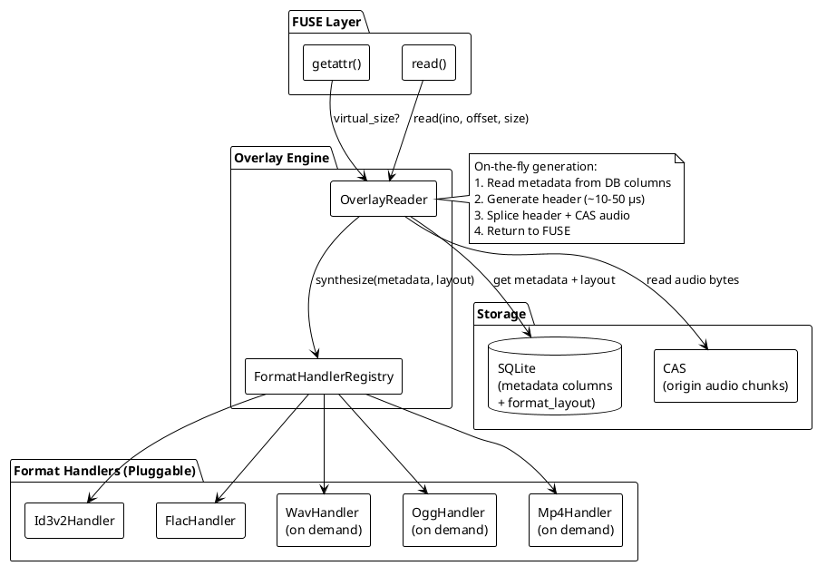
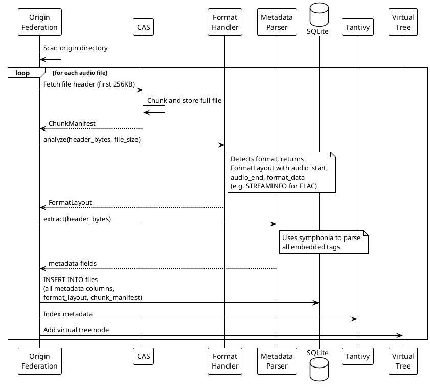
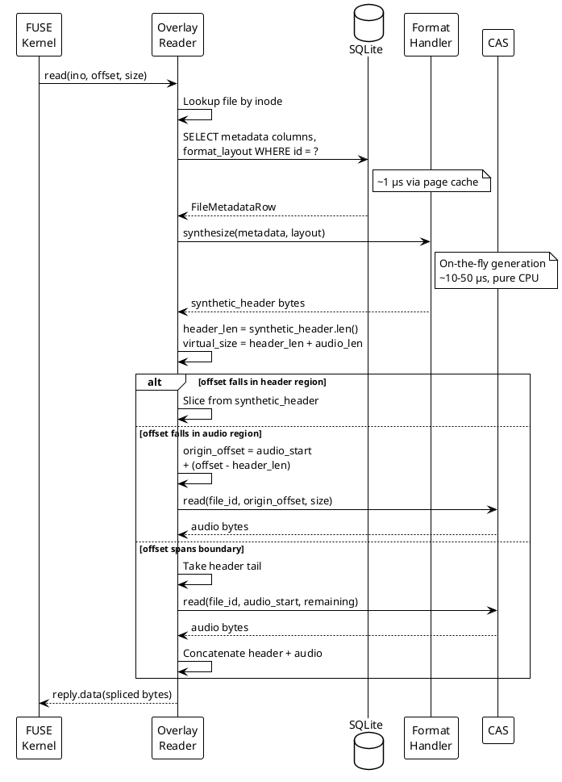
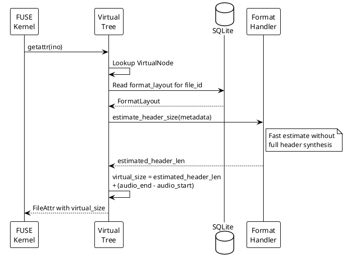
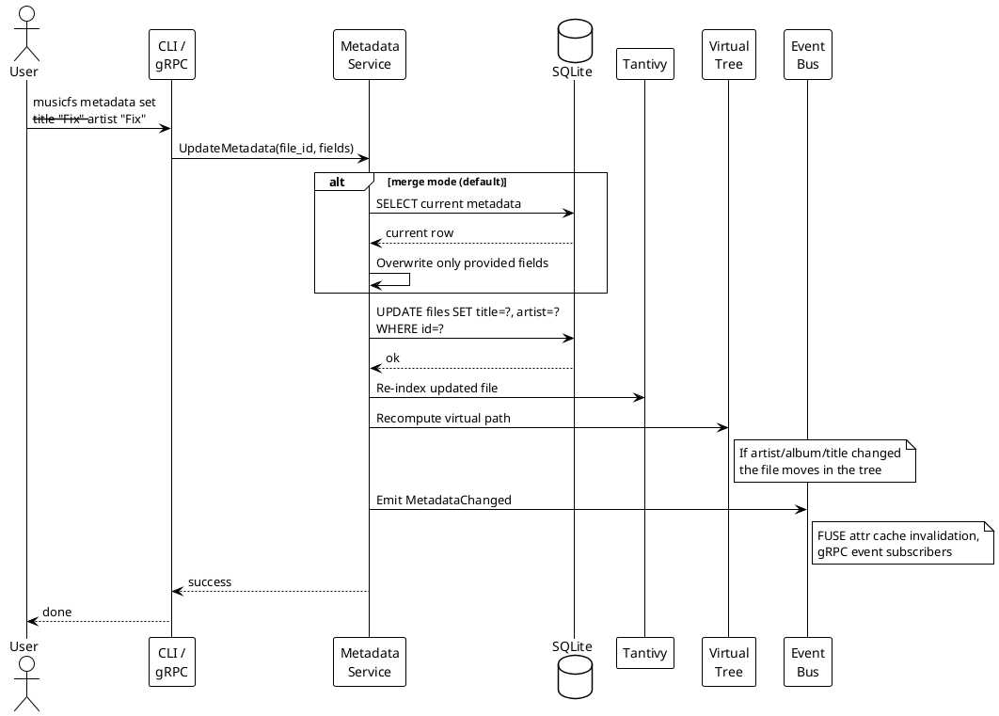
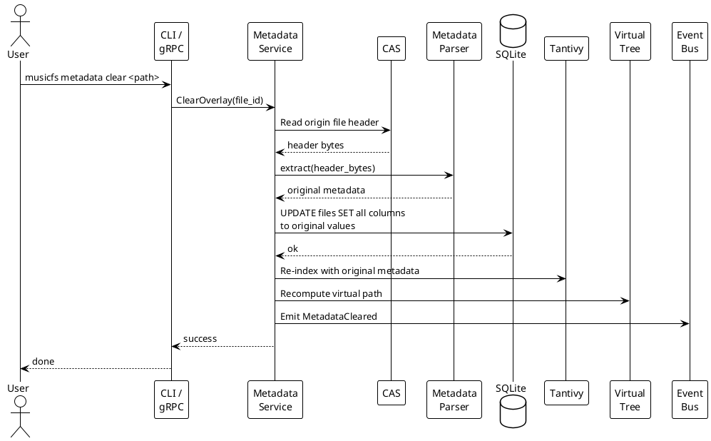
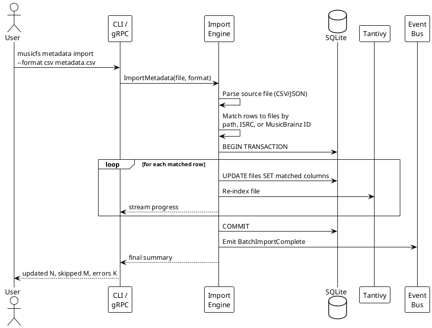

# Metadata Overlay: Design Doc

**Authors:** AI Assistant  
**Status:** Draft  
**Last Updated:** 2026-05-17  
**Reviewers:** [TBD]  
**Approvers:** [TBD]  
**Prerequisites:** [architecture.md](../architecture.md), [requirements.md](../requirements.md)

---

[TOC]

---

## 1. Abstract

Metadata Overlay enables MusicFS to serve **modified audio metadata** to
consumers (Jellyfin, Plex, mpv, VLC) while preserving original files on origin
storage. When a media server reads a file through the FUSE mount, it receives
metadata headers **generated on-the-fly** from the database, seamlessly spliced
with original audio data from the origin.

**Key constraints:**
- Never modify origin files (read-only architecture)
- Never duplicate entire files (storage-efficient)
- Support all audio formats via pluggable format handlers
- Transparent to consumers (standard file I/O)

**Solution approach:** Store metadata as individual database columns. On
`read()`, generate format-specific headers on-the-fly (~10-50 μs) and splice
them with original audio bytes using offset translation. No pre-generated
headers are stored.

---

## 2. Background

### 2.1 Current State

MusicFS serves files with their **original embedded metadata**. The metadata
extraction flow is:

```
Origin File → symphonia parser → AudioMeta struct → SQLite DB → Virtual paths
                                                                      ↓
FUSE read() ← CAS chunks ← Origin (unchanged bytes)
```

The database stores metadata for virtual path generation and search, but file
content is served verbatim from origin/CAS. Only 12 metadata fields are
stored: title, artist, album, album_artist, genre, year, track, disc,
duration_ms, bitrate, sample_rate, format.

### 2.2 Pain Points

| Problem | Impact |
|---------|--------|
| Cannot fix incorrect tags | Jellyfin shows wrong artist/album |
| Cannot add missing metadata | Files with no tags appear as "Unknown" |
| Origin is authoritative | User edits require modifying source files |
| Breaks torrent seeding | Modifying origin invalidates checksums |
| Missing fields | Only 12 of ~30 standard fields stored |

### 2.3 User Stories

1. **Tag Correction:** "Origin files have 'The Beatles' tagged as 'Beatles,
   The'. I want Jellyfin to see the correct name without modifying my NAS."

2. **Missing Metadata:** "My FLAC rips have no album art or year. I want to
   add them in MusicFS so Plex displays proper covers."

3. **Torrent Preservation:** "My music is seeding. I can't modify files but
   want correct tags in my media server."

4. **Multi-Library Views:** "I want one physical file to appear in both
   'Classical' and 'Relaxation' collections with different metadata."

---

## 3. Goals & Non-Goals

### 3.1 Goals

| ID | Goal | Success Metric |
|----|------|----------------|
| G1 | Serve modified metadata transparently | Players read edited tags without special handling |
| G2 | Zero origin modification | Origin files byte-identical before/after |
| G3 | Zero storage overhead for headers | No pre-generated header blobs stored |
| G4 | MP3 and FLAC out of the box | Other formats added on demand via plugins |
| G5 | Pluggable format handlers | Add new format support without core changes |
| G6 | Unified metadata model | Single API regardless of underlying format |
| G7 | Sub-second edit latency | Metadata changes reflected on next read |

### 3.2 Non-Goals

| ID | Non-Goal | Rationale |
|----|----------|-----------|
| NG1 | Audio transcoding | Out of scope; separate feature |
| NG2 | Lossless round-trip | Synthesized headers may differ structurally from original |
| NG3 | Writing back to origin | Violates read-only principle |
| NG4 | Video file support | Focus on audio; defer to future |
| NG5 | Metadata sync to external DBs | Jellyfin/Plex have their own; not our concern |

---

## 4. Proposed Design

### 4.1 High-Level Architecture



### 4.2 Core Flows

#### 4.2.1 Flow: Initial Ingest (Origin Scan)

Triggered on mount or rescan. Extracts metadata from origin files and
populates all database columns.



#### 4.2.2 Flow: FUSE read() with Overlay

The core read path. Headers are generated on-the-fly from DB columns —
nothing pre-computed is stored.



#### 4.2.3 Flow: FUSE getattr() with Overlay

Returns the **virtual** file size (synthetic header + audio) instead of
the origin file size.



#### 4.2.4 Flow: Metadata Update (User Edits Tags)

Triggered via gRPC API or CLI. Updates DB columns directly. Next read()
generates a new header automatically.



#### 4.2.5 Flow: Metadata Clear (Revert to Original)

Removes user overrides. File reverts to serving original embedded metadata.



#### 4.2.6 Flow: Batch Import

Import metadata from external source (CSV, JSON, MusicBrainz dump).



### 4.3 Offset Translation

```
Virtual File (what consumer sees):
┌─────────────────────┬────────────────────────────────────────────┐
│  Synthetic Header   │              Original Audio                │
│  (N bytes)          │              (M bytes)                     │
│  generated on-fly   │              from CAS                      │
└─────────────────────┴────────────────────────────────────────────┘
0                     N                                          N+M
                      ↑                                            ↑
                   header_len                               virtual_size

Origin File (on storage):
┌─────────────────────┬────────────────────────────────────────────┐
│  Original Header    │              Original Audio                │
│  (X bytes)          │              (M bytes)                     │
└─────────────────────┴────────────────────────────────────────────┘
0                     X                                          X+M
                      ↑                                            ↑
              layout.audio_start                          layout.audio_end

Offset Translation:
  virtual_offset → origin_offset

  if virtual_offset < N:
      return synthetic_header[virtual_offset]
  else:
      origin_offset = X + (virtual_offset - N)
      return cas_read(file_id, origin_offset)
```

### 4.4 Format Handler Plugin System

#### 4.4.1 Handler Trait

```rust
/// Trait for format-specific metadata handling.
///
/// Implementations handle:
/// 1. Analyzing original files to find audio boundaries
/// 2. Synthesizing new headers from database metadata
///
/// Plugins implement this trait and register via FormatHandlerRegistry.
pub trait FormatHandler: Send + Sync + 'static {
    fn id(&self) -> &'static str;
    fn name(&self) -> &'static str;
    fn extensions(&self) -> &[&'static str];
    fn mime_types(&self) -> &[&'static str];

    /// Analyze file bytes to determine audio layout.
    fn analyze(&self, data: &[u8], file_size: u64) -> Result<FormatLayout, FormatError>;

    /// Synthesize header bytes from metadata. Called on every read().
    fn synthesize(
        &self,
        metadata: &FileMetadataRow,
        layout: &FormatLayout,
    ) -> Result<Vec<u8>, FormatError>;

    /// Extract metadata from header bytes (for initial ingest).
    fn extract(&self, data: &[u8]) -> Result<ExtractedMetadata, FormatError>;

    /// Estimate header size without full synthesis (for getattr).
    fn estimate_header_size(&self, metadata: &FileMetadataRow) -> usize {
        10 * 1024 // 10KB default
    }
}
```

#### 4.4.2 Handler Registry

```rust
pub struct FormatHandlerRegistry {
    handlers: HashMap<String, Arc<dyn FormatHandler>>,
    extension_map: HashMap<String, String>,
}

impl FormatHandlerRegistry {
    pub fn new() -> Self {
        // Only MP3 and FLAC shipped by default.
        // Other handlers registered via load_plugins() or register().
        let mut r = Self { .. };
        r.register(Arc::new(Id3v2Handler::new()));  // .mp3
        r.register(Arc::new(FlacHandler::new()));    // .flac
        r
    }
    pub fn register(&mut self, handler: Arc<dyn FormatHandler>) { /* ... */ }
    pub fn get_by_extension(&self, ext: &str) -> Option<Arc<dyn FormatHandler>> { /* ... */ }
    pub fn load_plugins(&mut self, plugin_dir: &Path) -> Result<usize> { /* ... */ }
}
```

#### 4.4.3 Format Complexity Summary

| Format | Handler | Complexity | Shipped |
|--------|---------|------------|---------|
| **MP3** | `Id3v2Handler` | Low | **Yes** — built-in |
| **FLAC** | `FlacHandler` | Low | **Yes** — built-in |
| **WAV** | `WavHandler` | Low | On demand |
| **OGG/Opus** | `OggHandler` | Medium | On demand |
| **M4A/MP4** | `Mp4Handler` | High | On demand |

MP3 and FLAC cover the vast majority of music libraries. Other formats
use the same `FormatHandler` trait and can be added as plugins or built-in
handlers when needed — the architecture does not change.

### 4.5 Database Schema

All metadata fields are individual columns. SQLite NULL columns cost 0 bytes.
Only `format_layout` and `custom_tags` are blobs.

```sql
PRAGMA journal_mode = WAL;
PRAGMA foreign_keys = ON;
PRAGMA synchronous = NORMAL;

CREATE TABLE IF NOT EXISTS files (
    id              INTEGER PRIMARY KEY,
    origin_id       TEXT NOT NULL,
    real_path       TEXT NOT NULL,
    virtual_path    TEXT NOT NULL,

    -- ═══ Core Identification ═══
    title           TEXT,
    artist          TEXT,
    album           TEXT,
    album_artist    TEXT,
    track_number    INTEGER,
    track_total     INTEGER,
    disc_number     INTEGER,
    disc_total      INTEGER,
    date            TEXT,               -- "2024" or "2024-05-17"
    year            INTEGER,            -- extracted for convenience
    genre           TEXT,

    -- ═══ Credits ═══
    composer        TEXT,
    comment         TEXT,
    lyrics          TEXT,
    copyright       TEXT,
    compilation     INTEGER,            -- 0/1

    -- ═══ Sorting ═══
    artist_sort         TEXT,
    album_artist_sort   TEXT,
    album_sort          TEXT,
    title_sort          TEXT,

    -- ═══ MusicBrainz IDs ═══
    mb_recording_id         TEXT,       -- Recording MBID
    mb_album_id             TEXT,       -- Release MBID
    mb_artist_id            TEXT,       -- Artist MBID
    mb_album_artist_id      TEXT,       -- Album Artist MBID
    mb_release_group_id     TEXT,       -- Release Group MBID

    -- ═══ ReplayGain ═══
    replaygain_track_gain   REAL,       -- dB
    replaygain_track_peak   REAL,       -- 0.0-1.0+
    replaygain_album_gain   REAL,
    replaygain_album_peak   REAL,

    -- ═══ Technical (from audio stream, read-only) ═══
    duration_ms     INTEGER,
    bitrate         INTEGER,            -- kbps
    sample_rate     INTEGER,            -- Hz
    channels        INTEGER,
    bits_per_sample INTEGER,
    format          TEXT,               -- "flac", "mp3", etc.
    encoder         TEXT,               -- encoding software

    -- ═══ Custom Tags (overflow for non-standard fields) ═══
    custom_tags     TEXT,               -- JSON: {"ISRC":"US1234","LABEL":"Sony"}

    -- ═══ Format Layout (for byte-range splicing) ═══
    -- Stored as msgpack blob. Contains audio_start, audio_end,
    -- format_data (STREAMINFO for FLAC, stco for MP4, etc.)
    format_layout   BLOB,

    -- ═══ Sync State ═══
    origin_mtime    INTEGER NOT NULL,
    origin_size     INTEGER NOT NULL,
    content_hash    TEXT,
    chunk_manifest  BLOB,
    last_sync       INTEGER NOT NULL DEFAULT (strftime('%s', 'now')),

    -- ═══ Trash (existing feature) ═══
    trashed         INTEGER NOT NULL DEFAULT 0,
    original_path   TEXT,
    trashed_at      INTEGER,

    UNIQUE(origin_id, real_path)
);

-- ═══ Indexes ═══
CREATE INDEX IF NOT EXISTS idx_files_virtual ON files(virtual_path);
CREATE INDEX IF NOT EXISTS idx_files_artist_album ON files(artist, album);
CREATE INDEX IF NOT EXISTS idx_files_content_hash ON files(content_hash);
CREATE INDEX IF NOT EXISTS idx_files_real ON files(origin_id, real_path);
CREATE INDEX IF NOT EXISTS idx_files_origin ON files(origin_id);
CREATE INDEX IF NOT EXISTS idx_files_last_sync ON files(last_sync);

CREATE INDEX IF NOT EXISTS idx_files_trashed ON files(trashed) WHERE trashed = 1;
CREATE INDEX IF NOT EXISTS idx_files_mb_album ON files(mb_album_id);
CREATE INDEX IF NOT EXISTS idx_files_mb_artist ON files(mb_artist_id);
CREATE INDEX IF NOT EXISTS idx_files_genre ON files(genre);
CREATE INDEX IF NOT EXISTS idx_files_year ON files(year);
CREATE INDEX IF NOT EXISTS idx_files_composer ON files(composer);

-- ═══ Artwork (unchanged, separate table) ═══
CREATE TABLE IF NOT EXISTS artwork (
    id          INTEGER PRIMARY KEY,
    file_id     INTEGER NOT NULL REFERENCES files(id) ON DELETE CASCADE,
    art_type    TEXT NOT NULL,
    chunk_hash  TEXT NOT NULL,
    width       INTEGER,
    height      INTEGER,
    mime_type   TEXT,
    UNIQUE(file_id, art_type)
);

CREATE INDEX IF NOT EXISTS idx_artwork_file ON artwork(file_id);

-- ═══ Collections (unchanged) ═══
CREATE TABLE IF NOT EXISTS collections (
    id          INTEGER PRIMARY KEY,
    name        TEXT NOT NULL UNIQUE,
    query_json  TEXT NOT NULL,
    created_at  INTEGER NOT NULL DEFAULT (strftime('%s', 'now')),
    updated_at  INTEGER NOT NULL DEFAULT (strftime('%s', 'now'))
);

-- ═══ Directories (unchanged) ═══
CREATE TABLE IF NOT EXISTS directories (
    id          INTEGER PRIMARY KEY,
    path        TEXT NOT NULL UNIQUE,
    created_at  INTEGER NOT NULL DEFAULT (strftime('%s', 'now'))
);

CREATE INDEX IF NOT EXISTS idx_directories_path ON directories(path);
```

### 4.6 Read Algorithm

```rust
impl OverlayReader {
    pub async fn read(
        &self,
        file_id: FileId,
        offset: u64,
        size: u32,
    ) -> Result<Bytes, ReaderError> {
        let file = self.db.get_file(file_id)?;
        let layout: FormatLayout = rmp_serde::from_slice(&file.format_layout)?;
        let handler = self.registry.get_by_format(&file.format)?;

        // Generate header on-the-fly (~10-50 μs)
        let header = handler.synthesize(&file, &layout)?;
        let header_len = header.len() as u64;
        let audio_len = layout.audio_end - layout.audio_start;
        let virtual_size = header_len + audio_len;
        let virtual_end = (offset + size as u64).min(virtual_size);

        if offset >= virtual_size {
            return Ok(Bytes::new());
        }

        let mut result = BytesMut::with_capacity((virtual_end - offset) as usize);

        // Region 1: Synthetic header
        if offset < header_len {
            let end = virtual_end.min(header_len);
            result.extend_from_slice(&header[offset as usize..end as usize]);
        }

        // Region 2: Origin audio data
        if virtual_end > header_len {
            let audio_start = header_len.max(offset) - header_len;
            let audio_size = (virtual_end - header_len.max(offset)) as u32;
            let origin_offset = layout.audio_start + audio_start;

            let audio = self.cas_reader.read(file_id, origin_offset, audio_size).await?;
            result.extend_from_slice(&audio);
        }

        Ok(result.freeze())
    }
}
```

### 4.7 API Design

#### 4.7.1 gRPC Extensions

```protobuf
service MetadataService {
    rpc GetMetadata(GetMetadataRequest) returns (MetadataResponse);
    rpc UpdateMetadata(UpdateMetadataRequest) returns (UpdateMetadataResponse);
    rpc ClearOverlay(ClearOverlayRequest) returns (ClearOverlayResponse);
    rpc BatchUpdateMetadata(BatchUpdateRequest) returns (stream BatchUpdateProgress);
    rpc ImportMetadata(ImportMetadataRequest) returns (stream ImportProgress);
}

message UpdateMetadataRequest {
    int64 file_id = 1;
    // Only set fields you want to change.
    // Unset fields are left as-is (merge behavior).
    optional string title = 2;
    optional string artist = 3;
    optional string album = 4;
    optional string album_artist = 5;
    optional uint32 track_number = 6;
    optional uint32 disc_number = 7;
    optional string date = 8;
    optional string genre = 9;
    optional string composer = 10;
    optional string comment = 11;
    optional string lyrics = 12;
    optional string copyright = 13;
    optional bool compilation = 14;
    optional string artist_sort = 15;
    optional string album_artist_sort = 16;
    optional string album_sort = 17;
    optional string title_sort = 18;
    optional string mb_recording_id = 20;
    optional string mb_album_id = 21;
    optional string mb_artist_id = 22;
    optional float replaygain_track_gain = 30;
    optional float replaygain_track_peak = 31;
    optional float replaygain_album_gain = 32;
    optional float replaygain_album_peak = 33;
    map<string, string> custom_tags = 50;
}
```

#### 4.7.2 CLI Interface

Two ways to set metadata: **flags** for quick single-field edits, **JSON**
for bulk or complex updates. Both can be combined.

```bash
# ── View ──

# Print all metadata as JSON
musicfs metadata get "/Artist/Album/01 - Track.flac"

# Print specific field
musicfs metadata get "/Artist/Album/01 - Track.flac" --field artist

# ── Edit via flags (one field at a time or several) ──

musicfs metadata set "/Artist/Album/01 - Track.flac" \
    --title "Corrected Title"

musicfs metadata set "/Artist/Album/01 - Track.flac" \
    --artist "Corrected Artist" \
    --album-artist "Corrected Artist" \
    --year 2024 \
    --genre "Rock"

# Every DB column has a corresponding flag:
#   --title, --artist, --album, --album-artist,
#   --track-number, --track-total, --disc-number, --disc-total,
#   --date, --year, --genre,
#   --composer, --comment, --lyrics, --copyright, --compilation,
#   --artist-sort, --album-artist-sort, --album-sort, --title-sort,
#   --mb-recording-id, --mb-album-id, --mb-artist-id,
#   --mb-album-artist-id, --mb-release-group-id,
#   --replaygain-track-gain, --replaygain-track-peak,
#   --replaygain-album-gain, --replaygain-album-peak,
#   --encoder

# Set a custom tag (anything not in the standard set)
musicfs metadata set "/path/to/file" --custom ISRC=US1234567890

# ── Edit via JSON (any number of fields at once) ──

# Inline JSON
musicfs metadata set "/Artist/Album/01 - Track.flac" --json '{
  "title": "Corrected Title",
  "artist": "Corrected Artist",
  "year": 2024,
  "custom_tags": {"ISRC": "US1234567890", "LABEL": "Sony"}
}'

# From file
musicfs metadata set "/Artist/Album/01 - Track.flac" --json @metadata.json

# Flags and JSON can be combined (flags take precedence)
musicfs metadata set "/path/to/file" --json @base.json --year 2025

# ── Revert ──

# Revert to original embedded metadata
musicfs metadata clear "/Artist/Album/01 - Track.flac"

# ── Diff ──

# Show what changed vs original
musicfs metadata diff "/Artist/Album/01 - Track.flac"

# ── Batch ──

# Import from CSV (columns map to field names)
musicfs metadata import --format csv metadata.csv

# Import from JSON (array of objects with "path" or "file_id" key)
musicfs metadata import --format json metadata.json

# Export
musicfs metadata export --output metadata.json
musicfs metadata export --query "artist:Beatles" --output beatles.json
```

---

## 5. Cross-Cutting Concerns

### 5.1 Security & Privacy

| Concern | Mitigation |
|---------|------------|
| Plugin isolation | Native plugins require explicit trust; future WASM sandboxing |
| No credential exposure | Overlays contain only metadata, never auth tokens |
| Backup/restore | All data in SQLite, included in standard backup |

### 5.2 Observability

**Metrics:**
```
musicfs_overlay_files_modified            # Files with user-edited metadata
musicfs_overlay_generation_us            # Histogram: header generation time
musicfs_overlay_read_total               # Reads served via overlay
```

**Logging:**
```
INFO  overlay.update  file_id=123 fields=[title,artist]
DEBUG overlay.read    file_id=123 offset=0 size=65536 generation_us=42
WARN  overlay.format  file_id=456 error="No handler for format=opus"
```

### 5.3 Scalability & Performance

| Metric | Target | Notes |
|--------|--------|-------|
| Header generation | <100 μs | ~10-50 μs typical, pure CPU |
| read() overhead vs passthrough | <5% | One DB read + one synthesize |
| getattr() overhead | <1 μs | estimate_header_size(), no full synthesis |
| Storage per file | 0 extra | Metadata already in columns |
| Memory (LRU cache) | Optional | Cache hot headers if profiling shows need |

### 5.4 Testing Plan

| Test Type | Coverage |
|-----------|----------|
| **Unit** | FormatHandler implementations, offset arithmetic |
| **Integration** | Full read path with overlays, DB round-trip |
| **Format Matrix** | Each format × {overlay on, overlay off} |
| **Fuzzing** | Malformed files, boundary offsets, huge metadata |
| **Player Compat** | mpv, VLC, Jellyfin, Plex, ffprobe |

---

## 6. Alternatives Considered

### 6.1 Alternative A: Pre-generate and Store Headers in DB

**Description:** Synthesize headers on metadata update, store as BLOB.

**Rejected Because:**
- 1-10 KB per file × 1M files = 1-10 GB unnecessary storage
- Cache invalidation complexity (must regenerate on any field change)
- Generation is <100 μs — faster than a SQLite BLOB read of that size
- More moving parts for no measurable benefit

### 6.2 Alternative B: NFO Sidecar Files

**Description:** Generate `.nfo` XML files alongside audio files.

**Rejected Because:**
- Only works with players that support NFO (Jellyfin, Plex)
- mpv, VLC, foobar2000 read embedded tags only
- Not transparent to all consumers

### 6.3 Alternative C: Full File Rewrite + CAS Cache

**Description:** Rewrite entire file with new metadata, cache in CAS.

**Rejected Because:**
- Doubles storage for modified files
- High CPU/memory on first access
- Defeats CAS deduplication

### 6.4 Alternative D: Metadata Blobs Instead of Columns

**Description:** Store metadata as a single msgpack/JSON blob per file.

**Rejected Because:**
- Not directly queryable (no `WHERE artist = ?`)
- Not indexable
- SQLite NULL columns cost 0 bytes — no space savings from blobs
- Schema is self-documenting with columns
- Virtual path templates can reference any column directly

---

## 7. Implementation Plan

### 7.1 Phase 1: Schema Migration + Core Types (3 days)

| Deliverable | Details |
|-------------|---------|
| Schema migration | Add new columns to files table |
| `FormatLayout` struct | Audio boundary description |
| `FormatHandler` trait | Plugin interface |
| `FormatHandlerRegistry` | Built-in handler registration |

**Exit Criteria:** DB migrates cleanly, types compile.

### 7.2 Phase 2: Ingest Pipeline Update (3 days)

| Deliverable | Details |
|-------------|---------|
| Update symphonia parser | Extract all new fields |
| Format analysis on ingest | Run `analyze()` → store `format_layout` |
| Populate new DB columns | All fields written on scan |

**Exit Criteria:** Full rescan populates all metadata columns.

### 7.3 Phase 3: Read Path + MP3/FLAC (5 days)

| Deliverable | Details |
|-------------|---------|
| `OverlayReader` | Splice logic in FUSE read() |
| `Id3v2Handler` | analyze + synthesize for MP3 |
| `FlacHandler` | analyze + synthesize for FLAC |
| FUSE getattr() | Return virtual_size |

**Exit Criteria:** ffprobe/mpv reads modified MP3 and FLAC tags.

### 7.4 Phase 4: API + CLI (3 days)

| Deliverable | Details |
|-------------|---------|
| gRPC MetadataService | get, set, clear, batch, import |
| CLI commands | `musicfs metadata {get,set,clear,diff,import,export}` |

**Exit Criteria:** Full API functional end-to-end.

### 7.6 Rollout

```toml
[experimental]
metadata_overlay = true   # Enable overlay feature

[metadata_overlay]
# Additional format handlers loaded from this directory
plugin_dir = "/etc/musicfs/format-plugins/"
```

**Files with no registered handler** for their format are served with
original bytes unchanged (passthrough). No error, no degradation.

---

## 8. Glossary & References

### 8.1 Glossary

| Term | Definition |
|------|------------|
| **Overlay** | Mode where file serves user-edited metadata instead of original |
| **Synthetic Header** | Format-specific metadata bytes generated on-the-fly |
| **Format Layout** | Description of audio/metadata byte boundaries in origin file |
| **Offset Translation** | Converting virtual file offset to origin file offset |

### 8.2 References

| Document | Link |
|----------|------|
| ID3v2.4 Specification | https://id3.org/id3v2.4.0-structure |
| FLAC Format | https://xiph.org/flac/format.html |
| OGG Encapsulation | https://xiph.org/ogg/doc/rfc3533.txt |
| MP4 Specification | ISO/IEC 14496-12 |
| MusicBrainz Picard Tag Mapping | https://picard-docs.musicbrainz.org/en/appendices/tag_mapping.html |
| symphonia StandardTagKey | https://docs.rs/symphonia-core/0.5.4/symphonia_core/meta/enum.StandardTagKey.html |
| lofty-rs | https://github.com/Serial-ATA/lofty-rs |
| MusicFS Architecture | [architecture.md](../architecture.md) |

### 8.3 New Dependencies

| Crate | Version | Purpose |
|-------|---------|---------|
| lofty | 0.24+ | Metadata header generation (all formats) |
